# C基础与杂项知识点
## Linux命令
### 打开终端的方式
- 直接点击终端图标打开 这种方式同时只能开一个终端（打开的是家目录）
- alt+crtl+t 打开家目录的新终端
- ctrl + shift+n 打开当前目录的新终端
- ctrl + shift+t 在当前终端内新建终端 打开的是当前目录
### 关闭终端
- 点击叉号直接关闭
- ctrl +d关闭当前活动终端
- 在终端输入exit也可以关闭终端
### 改变终端大小
- 放大终端 ctrl shift +
- 缩小终端 ctrl -
### 终端开头信息的含义(了解)
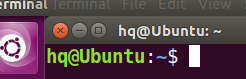
*参数含义*
- hq 这个表示 当前用户名
- @表示一个分隔符，分割作用
- Ubuntu 表示 **主机名**
- 这个波浪线~表示当前路径
- 这个美元$表示 命令提示符（告诉用户后面可以输入命令）
### 路径问题
路径分为两类
- 绝对路径 从根目录开始算
- 相对路径 从当前位置开始算
*查阅绝对路径，输入pwd命令即可*
### 查看用户名
输入下面指令即可查询
```sh
whoami
```
### 查看主机名
输入下面命令即可
```sh
hostname
```
### 查看文件
查看当前路径下的所有文件
```sh
ls
```
加入-l参数（或者直接输入ll）
*表示查看当前路径下的所有信息*
```sh
ls -l
```
*文件详细信息的参数含义*
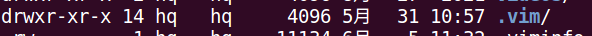
- 开头的d表示 文件类型
- rwx那一堆表示文件权限 : 文件所有者（Owner）、用户组（Group）、其它用户（Other Users）
- 14表示链接数
- 第一个hq表示用户名
- 第二个hq表示组名
- 4096 表示文件大小
- 这个时间表示最后一次修改的时间
- 最后面这个表示文件名
*文件权限中的横杠表示这个选项不可以，比如在r的位置放一个横杠表示不可读*

**该命令显示的文件大小的默认单位是字节，可以添加其他参数来显示单位，例如添加参数h来显示大小，会使用G M等来显示大文件**
```sh
ls -alh
```
前面是.开头的表示这个文件为隐藏文件
### 复制
```sh
cp 文件名 目标路径
```
复制目录文件
```sh
cp -r 目录文件名 目标路径
```
*复制的另一个功能是另存为*
```sh
cp 文件名 路径/新名字
```
### 移动
```sh
mv 普通文件/文件夹 目标路径
```
*给文件重命名*
```sh
mv 原文件名 新文件名
```
### Linux中的7类文件类型
*块设备文件*
用b表示，可以在根目录下查找具体是/dev
*字符设备文件*
c表示，在/dev/input/mouse查找
*目录文件*
用d表示， 表示目录文件，也就是文件夹
*普通文件*
用一根横杠表示。.c .h .txt之类的都属于
*软链接*
用l表示，相当于我们的快捷方式，在C高级中回接触到
*套接字文件*
用s表示 在网络编程中会用到
*管道文件*
会在io进程中学到

### 修改文件权限
修改权限 chmode 权限值 文件名
### cd切换路径
. 表示当前路径，但是可以忽略
cd .. 表示返回上一级
cd - 表示返回上次所在的路径
只输入cd表示返回家目录，也就是返回/home/用户名
### 新建文件方法
touch 文件名.后缀
touch 同名文件 会更新时间戳(不会覆盖文件)
### 新建文件夹方法
mkdir 文件夹名字
**递归创建文件夹**
mkdir -p /1/2/3
mkdir若创建同名文件夹会直接报错
### 删除文件夹
*删除普通文件*
rm 普通文件名
*删除文件夹*
rm -r 文件夹名字
## vi/vim编辑器
分为三个模式
- 命令行模式
- 插入模式
- 低行模式
**整理代码格式 gg=G**
## 编程语法发展历史
机器语言->汇编语言->高级语言
## gcc的编译流程
*第一步 预处理*
这一步负责展开头文件 删除注释 替换宏定义
```sh
gcc -E test.c -o test.i
```
*第二步 编译*
这一步会检查语法错误，没有语法问题的话，会转换为汇编语言生成汇编文件
```sh
gcc -S test.i -o test.s
```
*第三步 汇编*
这一步将汇编文件转换为二进制文件
```sh
gcc -c test.s -o test.o
```
*第四步 链接*
链接程序所用的库文件，最终生成机器能够识别的可执行文件
```sh
gcc test.o -o test
```
# 计算机数据表示形式
就是进制转换
数据大致分为两类
- 数值型数据 能进行算术运算并且能得到运算的顺序的数据
- 非数值型数据 就是指ASCII码

二进制(bin) 逢二进一
八进制(oct) 逢八进一
十进制(dec) 逢10进一
十六进制(hex) 用A表示10，F表示15

反斜杠0的ASCII值为0 一般作为字符串结束的标志
反斜杠n的ASCII为10，一般表示换行
空格的ASCII值为32 
字符0 的ASCII值为48
字符9 的ASCII值为57
**如果想把字符数字转换为真正的数字，只需要用字符数字的ASCII减去48就行**
大写字母+32=小写字母
小写字母-32=大写字母 
# 词法符号
*概念*：词法符号就是你在程序设置的时候在里面规定的一些有几个字符组成的一些简单的有意义的最小的语法单位。
## 关键字
*概念*：由系统预定义的具有特殊功能的词法符号。
## 存储类型：
- auto 自动
- static 静态
- extern 外部引用
- register 
数据类型：（在此不赘述）注意有符号和无符号是用来修饰的
## 构造类型：
- struct 结构体
- union 共用体
- enum 枚举
## 选择结构
if else switch case defaultS
循环结构
for while goto do break continue
其他功能
- void 空类型
- typedef 重定义
- const 常量化（表示只读）
- volatile 防止编译器优化
- return 函数返回值
- sizeof 计算数据所占空间大小
## 运算符
算数运算符
逻辑运算符
位运算符
位运算符的位指的是二进制里的每一位，指的是 0 和 1，没有真假，因为它不是一个逻辑上的判断真假，而是让你去计算  0 和 1 通过位运算符算出来的结果到底是什么样的，按位进行操作。分为下面几个大类。**位运算符都是针对补码进行操作**
- & (位与) 
- | (位或)		
- ^(异或)		
- ~(取反)		
- <<(左移)	
- (>>)右移	
- (>>> 无符号右移)**注意：没有无符号左移**
关系运算符
赋值运算符
三目运算符
*此处特别注意这个相除/*
**整数相除，向下取整，当你的除号两边都是整数的时候，得到的会是一个整数**
```c
int a=5/2;//a=2

float a=5/2;//a=2.000000

float a=5.0/2;//a=2.500000
```
*除法运算不止能用于整数运算，还可以用于别的计算，，但是取余计算只能用于整数计算*
练习：将1234的每个数位分别输出到终端上
千位：1234/1000
百位：1234/100%10
十位：1234/10%10
各位：1234%10
### 运算符优先级
单算移关与，异或逻条赋，从右向左单条赋。
单目运算符 	!  	~ 	 	++ 		 --
算术运算符 	*	 /	 %		 +	 -
移位运算符	 <<	 	>>
关系运算符 	<	 <= 		>	 >= 		==		 !=
位与运算符 	&
异/或运算符 	^ 	|
逻辑运算符	&& 		||
条件运算符 	?	:
赋值运算符 	=	+=	*=	/=	%=	...
## 原码补码（重点）
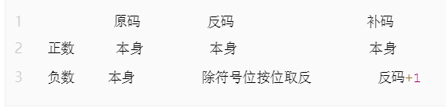
### 快速计算补码转换
**一般的计算方法**
```c
1、正数的原码 = 正数的反码 = 正数的补码
2、负数的原码 = 对应正数的原码 + 2的数据位数量次方，最高位作为符号位
3、负数的反码 = 负数的原码的符号位不变，其他数据取反
4、负数的补码 = 负数的反码+1
```
对原码从右往左数，知道遇到第一个数字1，1及1右边的数不变，1左边的数字按位求反。
**这个方法也能用来做补码到原码的转换**
负数的补码=（负数+2的数据数量次方）再对这个取二进制
把有符号位的负数，当作无符号数来表示，就可以知道，对于取反操作来说，负数的原码取反 = 2的数据位数量次方 - 负数原码 - 1
## 左移右移和取反的计算(重点)
### 右移
右移几位，左边补几个符号位(0-1)
```c
// 是正数就补0，是负数就补1
// 前提条件还是补码

8 >> 2 = 2(公式： 8/2^2 = 8/4 = 2)
0000 0010
-48 >> 4 = -3 (公式：-48/2^4 = -48/16 = -3)
// 正数都是向下取整
// 负数的话根据编辑器不一样，会产生的不一样的结果
```
### 左移
左移几位，右边补几个0
```c
8 << 2 = 32 (公式：8 * 2^2 = 8*4 = 32)
100000
-6 << 3 = -24 (公式：-6 * 2^3 = -6 * 8 = -48)
```
### 取反
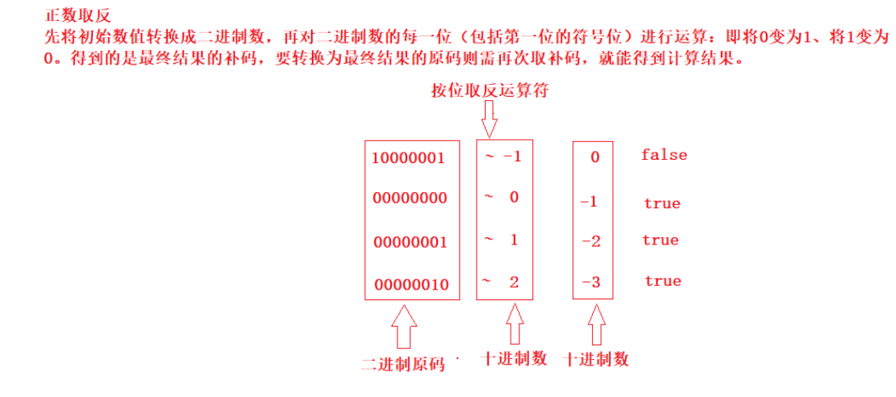
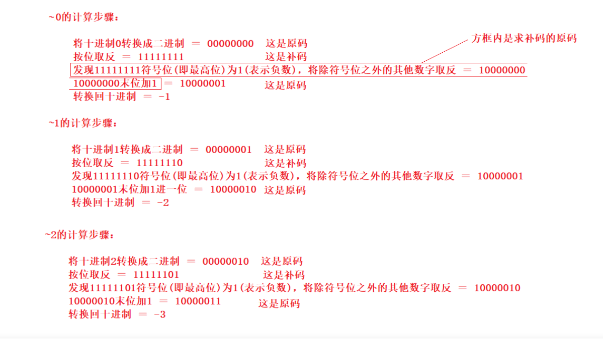
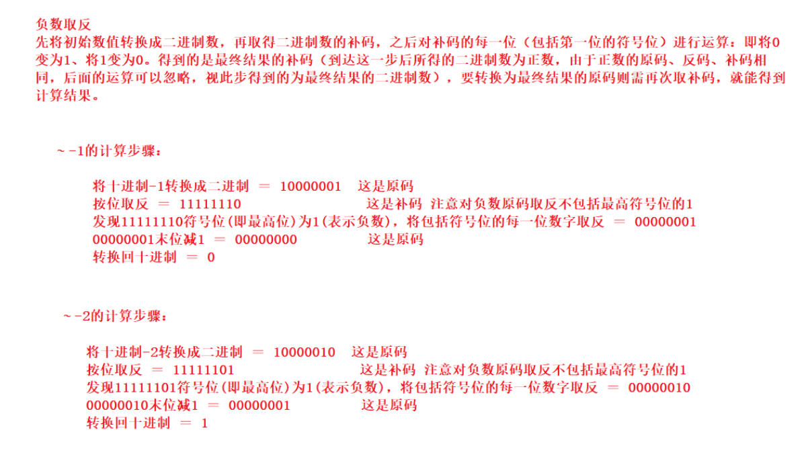
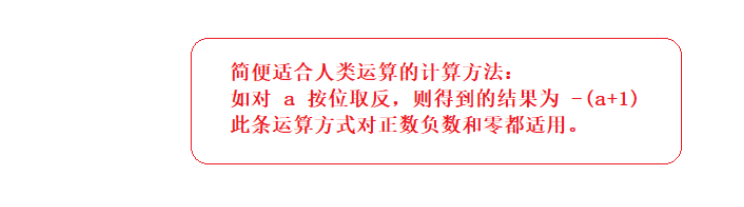
## 位运算的技巧
**我们的程序设计应该尽量贴合芯片硬件的特点**比如芯片进行位运算的效率是远高于
其他运算的，所以位运算的技巧能大大提高软件执行的效率。
###  位操作交换两个数
```c
//普通操作
void swap(int &a, int &b) {
  a = a + b;
  b = a - b;
  a = a - b;
}

//位与操作
void swap(int &a, int &b) {
  a ^= b;
  b ^= a;
  a ^= b;
}
```
*介绍*：
位与操作解释：第一步：a ^= b ---> a = (a^b);

第二步：b ^= a ---> b = b^(a^b) ---> b = (b^b)^a = a

第三步：a ^= b ---> a = (a^b)^a = (a^a)^b = b
### 位操作判断奇偶数
只要根据数的最后一位是 0 还是 1 来决定即可，为 0 就是偶数，为 1 就是奇数。
```c
if(0 == (a & 1)) {
 //偶数
}
```
###  位操作交换符号
交换符号将正数变成负数，负数变成正数
```c
int reversal(int a) {
  return ~a + 1;
}
```
整数取反加1，正好变成其对应的负数(补码表示)；负数取反加一，则变为其原码，即正数
### 位操作求绝对值
整数的绝对值是其本身，负数的绝对值正好可以对其进行取反加一求得，即我们首先判断其符号位（整数右移 31 位得到 0，负数右移 31 位得到 -1,即 0xffffffff），然后根据符号进行相应的操作
```c
int abs(int a) {
  int i = a >> 31;
  return i == 0 ? a : (~a + 1);
}
```
上面的操作可以进行优化，可以将 i == 0 的条件判断语句去掉。我们都知道符号位 i 只有两种情况，即 i = 0 为正，i = -1 为负。对于任何数与 0 异或都会保持不变，与 -1 即 0xffffffff 进行异或就相当于对此数进行取反,因此可以将上面三目元算符转换为((a^i)-i)，即整数时 a 与 0 异或得到本身，再减去 0，负数时与 0xffffffff 异或将 a 进行取反，然后在加上 1，即减去 i(i =-1)
```c
int abs2(int a) {
  int i = a >> 31;
  return ((a^i) - i);
}
```

### 位操作进行高低位交换
给定一个 16 位的无符号整数，将其高 8 位与低 8 位进行交换，求出交换后的值，如：
```c
34520的二进制表示：
10000110 11011000

将其高8位与低8位进行交换，得到一个新的二进制数：
11011000 10000110
其十进制为55430
```
从上面移位操作我们可以知道，只要将无符号数 a>>8 即可得到其高 8 位移到低 8 位，高位补 0；将 a<<8 即可将 低 8 位移到高 8 位，低 8 位补 0，然后将 a>>8 和 a<<8 进行或操作既可求得交换后的结果。
```c
unsigned short a = 34520;
a = (a >> 8) | (a << 8);
```
## 截断法则
- 逻辑或运算中：如果前面的表达式为真，则后面的 表达式不执行
- 逻辑与运算中：如果前面的表达式为假，则后面的表达式不执行
```c
#include <stdio.h>
int main()
{
    int a = 5, b = 6, c = 7, d = 8, m = 2, n = 2;
    (m = a > b) && (n = c < d);
    printf("%d %d", m, n); // 0    2
};
//上述代码会输出0 2
```
## 置一/置零公式
此处主要是左移右移来完成。多用于底层寄存器的操作。
- 置一公式：a | (1 << n)
- 置零公式：a & (~(1 << n))
## 标识符
有四个命名规则
- 由数字（单独一个数字不行） 字母 下划线(单个下划线做变量名也可以)组成
- 变量名的开头不能是数字
- 不能和关键字重名
- 命名规范，力求见名知意
## 分隔符
- 换行
- 空格 
- tab
## 标点符号
, ; {} [] ()
# 变量
概念：在程序运行中发生变化的量
*定义格式*：存储类型        数据类型           变量
- 存储类型控制变量存储的位置
- 数据类型就是变量所占字节的个数
数据类型的分类和取值范围如下图所示
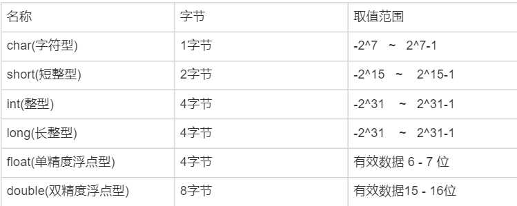
**注意上图中的浮点数和双精度浮点数，是存在有效位数的，超过这个位数会造成精度损失问题**
```c
#include<stdio.h>
#include<stdlib.h>
#include<string.h>

int main(int argc, char* argv[])
{
	float b=3.33333333;
	double c=123456789123456.3;
  float d=1.3456789;
	printf("%f\n",b);
	printf("%f\n",c);
 	printf("%f\n",d);

	return 0;
}//上述代码是为了验证二者的精度损失问题，可能在第六位或者第七位发生精度损失
//这个不一定
```
*现象*
```c
3.333333
123456789123456.296875
1.345679
```
*变量分类*
- 局部变量
- 全局变量
二者的比较如下图

指数表示的e后面不能跟括号，只能是常量或者常量表达式
且e只能表示10的多少次方，不是10的不能用，得用pow
# 常量
概念：程序运行过程中不会发生变化的量
## 字符型常量
```c
用 ' ' 括起来
'a'  -> 字符 a

a   ->    变量

'\0'   // 字符串结束的标志
'\n'   
' ' // 空格也可以是字符
'+'    '-'
'\x41'   ->   'A' //16进制转义
'\101'   ->   'A' //8进制转义
65       ->    'A' //10进制转义
```
## 字符串常量
```c
表示字符串：用 "" 括起来

"hello"  // 字符串里面最后总会有一个  \0 只是你看不到，它是默认存在的
```
## 整型常量

## 浮点型常量
## 指数常量
```c
1*10^6      写为    1e6
3*10^-10    写为    3e-10
// 不是 10 的几次方就不能用 e 了，要用 pow 函数
```
## 标识常量
```c
宏定义：起标识作用
遵循标识符的命名规则
一般会用大写表示
格式：#define 宏名 常量或表达式
    #define NUM 3
特点：只能单纯替换，不要进行手动运算(原样替换，替换完在计算)
#define MAX(m,n) m>n?m:n
```
# 输入输出
## 按字符输入
```c
int getchar(void);
功能：从终端输入一个字符
参数：无
返回值：输入字符的ASCII值

int ch = getchar();

getchar()
```
## 按字符输出
```c
int putchar(int c);

功能：向终端输出一个字符
参数：c：要输出字符的ASCII值
返回值：要输出字符的ASCII值

putchar(10); // putchar('\n'); // 这两种方式都是可以的
putchar('a'); // putchar(97); // 一般是不会这么写的
// 注意：他只能输出一个字符
```
## 按格式输出
```c
// man 3 printf
int printf(const char *format, ...);
功能：按照指定格式向终端输出
参数：format：字符串    "hello nihao"
格式：
    "%d"    int
    "%f"    float
    "%lf"    double
    "%c"    char
    "%s"    字符串
    "%p"    地址
    "%e"    指数
    "%#x"    十六进制
    "%#o"    八进制
    "%-m.n"    含义：
        .n：打印小数点后几位
        m：位宽
        -左对齐，默认是右对齐
返回值：输出字符的个数(不常用)

int d = 1;
int ret = printf("%d\n", d);
printf("%d\n", ret); // 2    
```
## 按格式输入
int scanf(const char *format, ...);
功能：按格式从终端输入
参数：同 printf // 你用来输入的时候后面放的是变量的地址
返回值：正确输入数据的个数
当第一个数输入的格式不正确时，会直接返回 0
## 垃圾字符回收(重点)
**1. 通过空格回收，这种用的也多**
```c
scanf("%c %c", &a, &ch);
```
可以回收一个或多个的空格、回车、tab
2. %*c
只能回收任意一个字符
```c
char a;
char ch;
scanf("%c%*c%c", &a, &ch);
printf("a=%c ch=%c\n", a, ch);
```
**3. getchar()这种用的多**
只能回收任意一个字符，一般用于循环里面
```c
while (1)
{
    char a;
    scanf("%c", &a);
    printf("%c/n", a);
    while (getchar() != '\n');
 
}
```
```c
#include <stdio.h>
#include <stdlib.h>
int main(void)
{
    int a, c;
    char b;
    printf("input a: ");
    scanf("%d", &a); //将前一个scanf输入的缓冲区通过循环全部清空
    while (getchar() != '\n')//表示只要字符不是回车就继续吃缓冲区字符
    {
        ;//空语句
    }
    printf("\ninput b,c\n");
    scanf("%c,%d", &b, &c);
    printf("a = %d, b = %c, c = %d\n", a, b, c);  system("pause");
}
```
# 强制转换
存在的问题，能将低类型的强转为高类型的
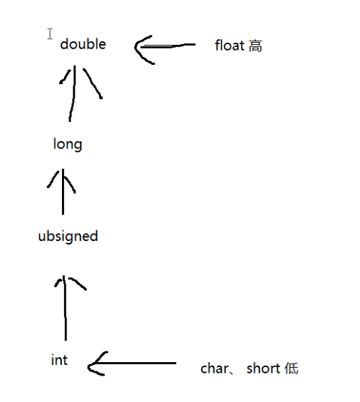
横向的表示必须转换（有些是系统自动转换），纵向的表示从低到高的转换。
在强制转换的时候可能会造成数据丢失和精度损失
```c
// int a = 5;
// float b = a/2;
// float c = (float)a/2;
// printf("%f%f\n",b,c);
int a = 1.0f;
printf("%d\n", a); // 1
printf("%d\n", 1.0); // 0
printf("%d\n", sizeof(1.0));  // 8 在系统中会默认认为1.0是double
printf("%d\n", (int)1.0);  // 1
printf("%f\n", 1); // 1.000000
printf("%d\n", (int)(1.0 + 'A')); // 66
float fl = 1.12;
printf("%d %f\n", (int)fl, fl); // 1 1.120000
```
# 分支语句
## if else
```c
// 基本结构
if(表达式)
{
    语句块一;
} 
else 
{
    语句块二;
}

    int a;
    scanf("%d", &a);
    if(a>3 && a<5)
    {
        printf("%d\n", a);
    }
    else 
    {
        printf("nonono\n");
    }

// 分层结构
if(表达式一)
{
    语句块一;
} 
else if(表达式二)
{
    语句块二
}
else 
{
    // 都不符合条件
    语句块三;
}

// 嵌套结构
if(表达式一)
{
    // 语句块一
    if(表达式二)
    {
        语句块二;
    }
    else 
    {
        语句块三;
    }
}
else 
{
    语句块;
}
1）if后面可以没有 else，但是 else前面必须有if
2）if 和 else 后面的 {} 可以省略，但是只能匹配之后的一条语句
```
## switch case
```c
switch(变量或表达式)
{
    case 常量一: 
        语句块一; 
    break;
     case 常量二: 
        语句块二; 
    break;
     case 常量三: 
        语句块三; 
    break;
    ....
     case 常量n: 
        语句块n; 
    break;
    default: 语句块 n+1
}

执行顺序：
判断 switch 后面的表达式的结果，和 case 后的常量相匹配，
如果匹配成功，就执行相对应的语句块，
如果没有匹配成功就执行 default 后面语句块，遇到 break 结束
```
# 循环
**在进行死循环的时候for(;;)的优化比while(1)好，所以尽量用for(;;)完成**
## for循环
```c
for(表达式1; 表达式2; 表达式3)
{
    语句块;  // 4
}
表达式1：赋初值
表达式2：循环终止条件
表达式3：增值或减值

int i;
    for (i = 0; i < 3; i++)
    {
        printf("%d\n", i);
    }
    printf("\n");

执行顺序：
首先执行表达式1进行赋值，然后判断表达式2是否成立，
如果成立就进入循环、执行语句块，再执行表达式3进行增值或减值
然后继续判断表达式2是否成立，直到表达式2不成立，退出循环
// 124 324 324 ... 直到 2 不成立
```
*嵌套结构*
```c
for(表达式1; 表达式2; 表达式3)
{
    for(表达式4; 表达式5; 表达式6)
    {
        语句块;  // 7
    }
}
// 外部的循环执行一次，内部循环执行一遍
```
### for循环的三种变形结构
**变形1**
```c
int i = 0;
for(; 表达式2; 表达式3)
{
    语句块;
}
```
**变形2**
```c
int i = 0;
for(; 表达式2;)
{
    语句块;
    表达式3;
}
```
**变形3**
```c
int i = 0;
for( ; ;) // 死循环
{
    if(表达式2)
    {
        语句块;
        表达式3;
    }
    else
    {
        break;
    }
}
```
## while循环
```c
格式：
定义循环变量并赋值;
while(判断条件) // 表达式
{
    语句块;
    增值或减值语句;
}

int i = 0,sum = 0;
    while (i < 10)
    {
        sum += i;
        i++;
    }
    printf("%d\n", sum);
    
执行顺序：
首先定义循环变量并赋值，然后判断是否符合循环条件，如果符合就执行语句块以及增值减值语句，然后继续判断，直到不符合循环条件，就会退出循环.
```
## do while循环
```c
定义循环变量并赋值
do
{
    语句块;
    增值减值语句;
}while(判断条件); // 循环终止条件
先执行后判断
最起码会先执行一次

//死循环
for(;;){}
while(1){}

while(1);
```
## 循环控制语句
```c
break;    continue;

break：直接结束循环
continue：结束本次循环，继续下一次循环

使用场景：
    使用在循环语句，结束循环
    使用时需要判断条件
```
# 数组
概念：具有一定顺寻的若干变量的集合
定义格式：存储类型  数据类型  数组名[元素个数]
访问元素：数组名[下标]，*下标从0开始*
访问第一个元素：a[0]
访问第n个元素：a[n-1]
**数组名**：代表数组首地址，数组名是**地址常量，不能为左值，不能被赋值**
## 注意数组越界问题
一个有数组有n个元素，则a[n-1]是能访问的最后一个元素，超过规定大小越界访问会发生段错误。
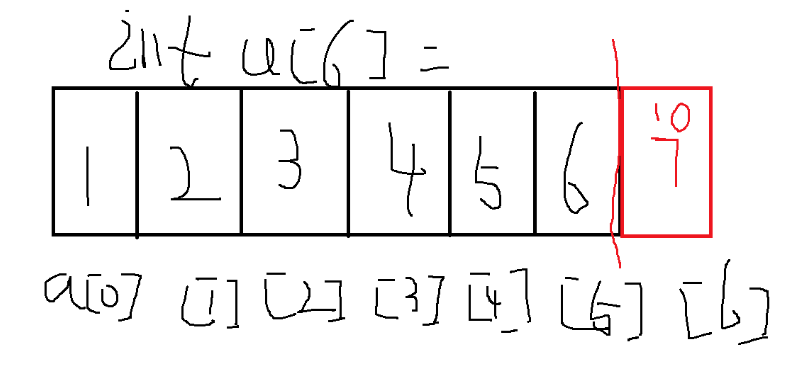
如图所示，定义一个int a[6]的数组，黑色标号的位置是可以正常访问的位置，红色位置我们是不能进行访问的，否则会造成数组越界的问题。
## 数组的特点
- 数据类型是相同的
- 内存是连续的
## 定义数组时需注意的问题
- 数组的数据类型和数组原色的数据类型一样
- 数组名要符合标识符命名规则
- 在*同一个函数*中，数组名不要与变量名相同
- 下标从0开始，到n-1结束
### 关于定义数组的一些探讨
*高版本gcc已经支持int a[];这种形式来定义变长数组，低版本gcc也可以通过int a[0];这种形式来完成变长数组使用*，**但是切记定义数组还是不能在方框里面填写变量。**
```c
#include <stdio.h>
#include <strings.h>
#include <stdlib.h>
int main()
{
    int num=5;
    int a[num]={0};
    for (size_t i = 0; i < num; i++)
    {
        printf("%d\n",a[i]);
    }
}
```
报错信息如下
```sh
test.c: In function ‘main’:
test.c:7:5: error: variable-sized object may not be initialized
     int a[num]={0};
     ^
test.c:7:17: warning: excess elements in array initializer
     int a[num]={0};
                 ^
test.c:7:17: note: (near initialization for ‘a’)
```
**但是如果你换一种写法，你就可以骗过编译器**
```c
#include <stdio.h>
#include <strings.h>
#include <stdlib.h>
int main()
{
    int num=5;
    int a[num];
    for (size_t i = 0; i < num; i++)
    {
        printf("%d\n",a[i]);
    }
}
```
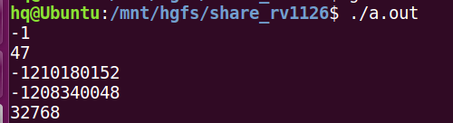
此时不会报错不会警告，由于没有初始化，所以输出的是脏数据。下一步做出大胆假设此时已经可以正常访问，但是初始化数组的方式得换一种思路
```c
#include <stdio.h>
#include <strings.h>
#include <stdlib.h>
int main()
{
    int num=5;
    int a[num];
    memset(a,0,num*sizeof(int));
    for (size_t i = 0; i < num; i++)
    {
        printf("%d\n",a[i]);
    }
}
```
**成功运行，效果如下**
```sh
hq@Ubuntu:/mnt/hgfs/share_rv1126$ gcc test.c 
test.c: In function ‘main’:
test.c:8:5: warning: implicit declaration of function ‘memset’ [-Wimplicit-function-declaration]
     memset(a,0,num*sizeof(int));
     ^
test.c:8:5: warning: incompatible implicit declaration of built-in function ‘memset’
test.c:8:5: note: include ‘<string.h>’ or provide a declaration of ‘memset’
hq@Ubuntu:/mnt/hgfs/share_rv1126$ ./a.out 
0
0
0
0
0
```
*用循环单独赋值也是可以通过*
```c
#include <stdio.h>
#include <strings.h>
#include <stdlib.h>
int main()
{
    int num=5;
    int a[num];
    for (size_t i = 0; i < num; i++)
    {
        printf("请输入数字\n");
        scanf("%d",&a[i]);
    }
    for (size_t i = 0; i < num; i++)
    {
        printf("%d\n",a[i]);
    }
}
```
*成功运行，效果如下*
```sh
hq@Ubuntu:/mnt/hgfs/share_rv1126$ gcc test.c 
hq@Ubuntu:/mnt/hgfs/share_rv1126$ ./a.out 
请输入数字
1
请输入数字
2
请输入数字
3
请输入数字
4
请输入数字
5
1
2
3
4
5
```
**尝试利用const**
```c
#include <stdio.h>
#include <strings.h>
#include <stdlib.h>
int main()
{
    const int num=5;
    int a[num]={0};
    for (size_t i = 0; i < num; i++)
    {
        printf("%d\n",a[i]);
    }
}
```
不行，直接报错，log显示gcc不认为num是个常量
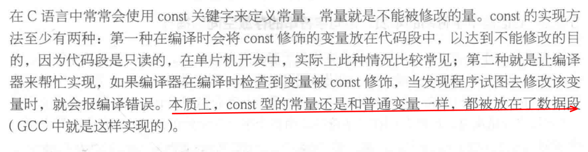
**利用宏定义也可以代替数组元素个数**
```c
#include <stdio.h>
#include <strings.h>
#include <stdlib.h>
#define num 5
int main()
{
    int a[num]={};
    for (size_t i = 0; i < num; i++)
    {
        printf("%d\n",a[i]);
    }
}
```
效果如下
```sh
hq@Ubuntu:/mnt/hgfs/share_rv1126$ gcc test.c 
hq@Ubuntu:/mnt/hgfs/share_rv1126$ ./a.out 
0
0
0
0
0
```


## 数组的分类
### 一维数组
概念：只有一个下标的数组
- 1.格式：存储类型		数据类型		数组名[元素个数]
- 2.访问元素：数组名[下标]，下标从 0 开始
- 3.数组名：数组首地址
- 4.初始化：可以在定义的同时进行赋值
#### 初始化的三种方式
**1. 全部初始化**
```c
    // 分别放上第一个元素到最后一个元素全部的数值
    int arr[5] = {1,2,3,4,5};
```
**2. 部分初始化,未初始化部分元素值为 0**
```c
    int arr[5] = {1,2};
```
**3. 未初始化： 每个元素都是随机值**
```c
    int arr[5];
    arr[0] = 1;  // 其他位置的值依然是随机值,

```
#### 定义空数组
**1 全部初始化**
```c
int arr[5] = {0,0,0,0,0};
```
**2 部分初始化**
```c
int arr[5] = {0};
```
**3 只写括号**
```c
int arr[5] = {};
```
这三种方式都可以定义一个空数组

**疑问：数组大小为什么不考虑内存对齐呢？**

## 清零函数
这类函数可以批量操作数组元素
### bzero
```c
#include <strings.h>
void bzero(void *s, size_t n);
```
功能：将内存空间设置为0
参数：s:要清空的空间的地址
    n: 字节大小
返回值：无
```c
//示例
#include <stdio.h>
#include <strings.h>
#include <stdlib.h>
int a[5] = {1,2,3,4,5};

int main(void)
{
    bzero(a,sizeof(a));
    for (size_t i = 0; i < 5; i++)
    {
        printf("%d\n",a[i]);
    }
    
}
```
运行现象
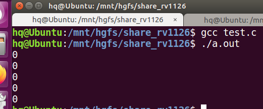
### memset
```c
#include <string.h>
    void *memset(void *s, int c, size_t n);
```
功能：将内存空间设置为0
参数：s：要清空的空间的地址
    c：要设置的值，设置为 0  -1;
    n：字节大小
```c
//示例
#include <stdio.h>
#include <strings.h>
#include <stdlib.h>
int a[5] = {1,2,3,4,5};
int main(void)
{
    memset(a, 0, sizeof(a));
    printf("这是 memset\n");
    for (size_t i = 0; i < 5; i++)
    {
        printf("%d\n", a[i]);
    }

}
```
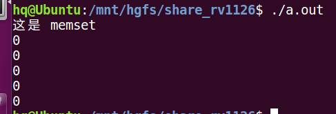
**注意：尽管该函数可以批量复制别的值，但是该函数最稳妥的用法是给字符数组赋值'\0',给int数组赋值0，因为这个函数的底层工作机制不一样**
下图是glibc的函数讲解
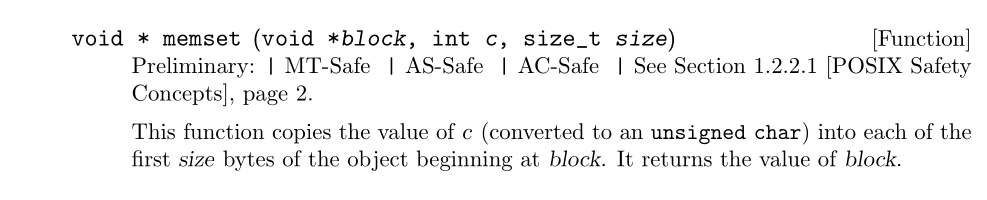
**一个整型数组的每个元素在32位系统中所占空间为4个字节，该函数进行赋值的时候会把数据元素的从右到左的字节，按位操作，例如下面的示例**
```c
#include <stdio.h>
#include <strings.h>
#include <stdlib.h>
int a[5] = {1,2,3,4,5};
int main(void)
{
    memset(a,7, sizeof(a));
    printf("这是 memset\n");
    for (size_t i = 0; i < 5; i++)
    {
        printf("%d\n", a[i]);
    }

}
```
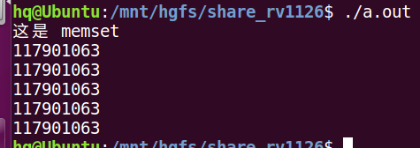
我们预想的效果是每一个数据元素都被赋值为7，但是实际上每个数据元素的数都很大，
**注意这个很大的数不是随机数，而是函数正确操作的结果**
```c
#include <stdio.h>
#include <strings.h>
#include <stdlib.h>
int a[5] = {1,2,3,4,5};
int main(void)
{
    memset(a,7, sizeof(a));
    printf("这是 memset\n");
    for (size_t i = 0; i < 5; i++)
    {
        printf("%x\n", a[i]);
    }
}
```
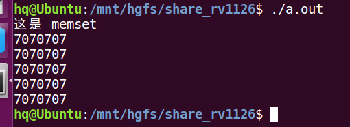
这是以十六进制输出的现象,最高位把0省略了，其实现在每个元素都是
0x07070707一共4个字节，07就代表8位一个字节，这个函数执行之后，会把每个字节从最低位开始以二进制的形式修改为你输入的值。
**验证一下这个推测**
```c
#include <stdio.h>
#include <strings.h>
#include <stdlib.h>
int a[5] = {1,2,3,4,5};
int main(void)
{
    memset(a,17, sizeof(a));
    printf("这是 memset\n");
    for (size_t i = 0; i < 5; i++)
    {
        printf("%x\n", a[i]);
    }
}
```
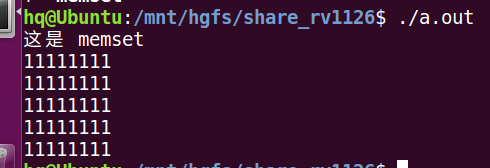
*分析*：11就是8位代表一个字节，转换为2进制就是00010001，也就是17，符合推测
## 字符数组
字符数组存放字符串

1. 概念：元素的数据类型为字符型的数组
2. 形式：
```c
    char a[] = {'h', 'e', 'l', 'l', 'o'};
    
    char b[] = {"world"}; // 字符串结尾默认有一个 \0 也算字符
    sizeof(b) // 6
    
    char c[] = "hello";
    
    char c[32] = "hello";
    sizeof(c) // 32
```
注意：字符串赋值常常会省略数组的长度，需要注意数组越界问题
### 字符数组的输入
```c
char str[32] = {};
1. scanf("%s", str);
char str[32] = {};
    scanf("%s", str);
    printf("%s\n", str);
    
输入的字符串不能还有空格，因为 scanf 输入字符串遇到空格或者 \n 都会认为字符串输入结束，空格后面的内容就不能在存放在数组里面

如果需要输入空格按以下格式输入：
scanf("%[^\n]", str); // 直到遇到 \n 才结束

2. for(i = 0; i<32; i++)
{
    scanf("%c", &a[i]);
}

3. gets
char *gets(char *s);

功能：从终端获取字符串
参数：s：目标字符串的首地址
返回值：目标字符数组的首地址

char str[32] = {};
    gets(str);    printf("%s\n", str);
    return 0;
```
### C语言定义字符串的其他形式
有时候这种定义字符串的形式上不灵活，由于数组本质上就是利用指针开辟的内存空间，所以还有一些变体来完成。
**1 直接利用指针**
```c
#include <stdio.h>
#include <strings.h>
#include <stdlib.h>
char *p="hello world";
int main(void)
{
        printf("%s\n", p);
}
```
*现象*
```sh
hello world
```
**但是这种写法也是有弊端的，你初始化之后是不能再对它进行修改的（进行修改直接段错误），因为编译器会把“hello world”这个字符串分配在代码段，也就是说这个是常量字符串，不是变量字符串**
_注意下面这种情况_
尽管不能对这个字符串修改，但是可以再定义一个指针（**名字可以一样**）
```c
#include <stdio.h>
#include <strings.h>
#include <stdlib.h>
char *p="hello world";
int main(void)
{
    printf("%s\n", p);
    char *p="竟然真的能用";
    printf("%s\n", p);
}
```
现象如下图所示
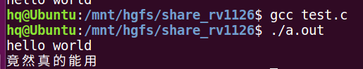
**2 利用数组指针**
```c
#include <stdio.h>
#include <strings.h>
#include <stdlib.h>
int main()
{
    char *test[]={"hello","world"};
    //为了方便理解可以写为下面这样，效果一样
    //char *(test[])={"test","one"};
    printf("%s\n",test[1]);

}//上述代码执行之后会输出world字符串
```
也能类似二维数组的形式进行访问单个字符
```c
#include <stdio.h>
#include <strings.h>
#include <stdlib.h>
int main()
{
    char *test[]={"hello","world"};
    printf("%c\n",*(test[0]+1));

}//上述代码执行后输出e这一个字符
```
**分析**：test[]是一个指针数组，里面有两个元素，每个元素都指向一个字符串常量，和之前说的一样，此处初始化之后也是不能修改字符串内容
#### 字符串和字符串数组的区别
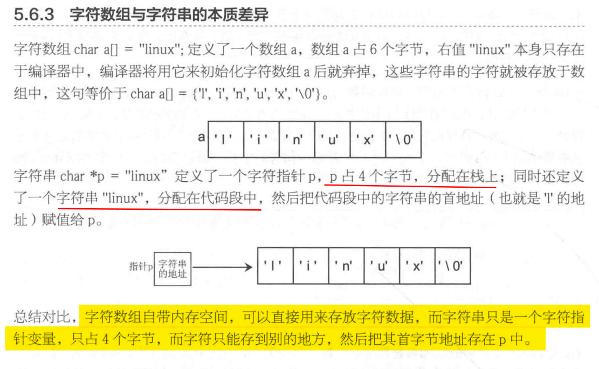
### 字符数组的输出
```c
1. prinf("%s\n", str);

2. for(int i = 0; i < 32; i++)
    printf("%c", s[i]);
    
3. puts
int puts(const char *s);
功能：向终端输出字符串
参数：s：要输出字符数组的首地址
返回值：输出字符的个数

char str[10] = "hello";
    int ch = puts(str);
    printf("%d\n", ch);
```
### 字符数组小练习
判断下面初始化字符数组的语句对错
```c
char s[10] = {};

s[10] = "hello"; // 错 S[10]是一个具体元素，直接赋值字符串造成越界，
s = "hello"; // 错 S是数组名代表地址常量
strlen(s);  // 对
```
### 判断字符数组长度问题
尽管可以借助strlen函数来计算有效字符串的长度，但是由于C语言的转义字符机制，导致
经常混淆错误。
```c
int main()
{
    char str[]=" ";//输入一个空格
    printf("长度是%d\n",strlen(str));
    printf("所占空间大小是%d\n",sizeof(str));
}
```
上述代码的执行结果
```sh
长度是1
所占空间大小是2
```
因为这种初始化方式是编译器会认为你把一个字符串塞进数组里，数组末尾会插入反斜杠0
计算空间会计入这个字符，计算长度不会计算这个字符。
**下面这种情况需要注意**
```c
int main()
{
    char str[]="\ \\";//输入一个反斜杠空格
    printf("长度是%d\n",strlen(str));
    printf("所占空间大小是%d\n",sizeof(str));
}
```
上述代码的执行结果
```sh
长度是2
所占空间大小是3
```
**分析**:C语言内部识别转义字符就是靠这个反斜杠标志，遇到反斜杠会把反斜杠和它后面的那个字符，看作一个整体的转义字符，并把它认为的这个转义字符分配一个字符的内存空间，就是算作一个字符。反斜杠空格当作一个字符，两个反斜杠也会认为一个转义字符，所以长度是2，空间是3


