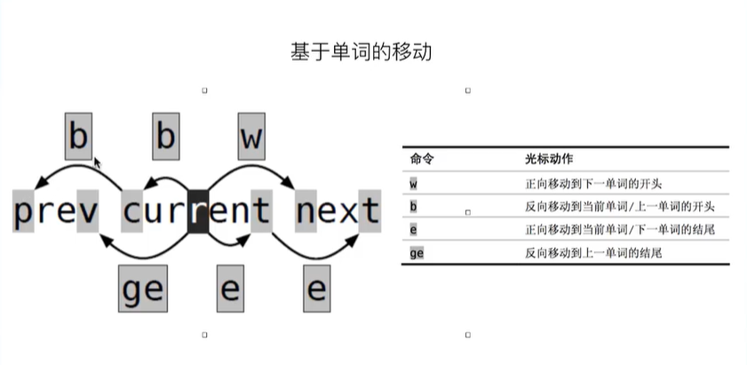
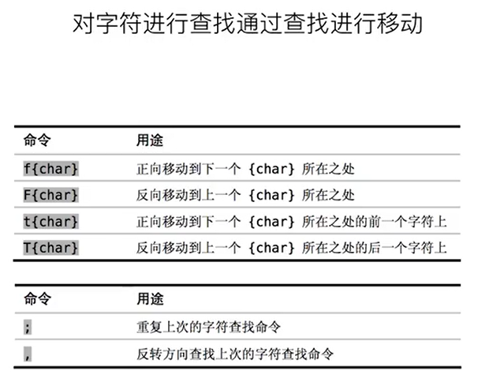
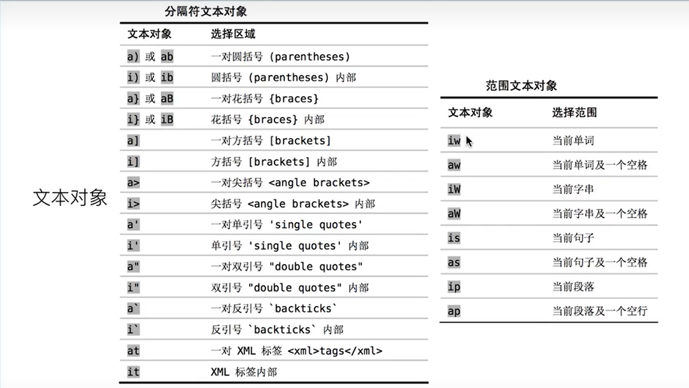
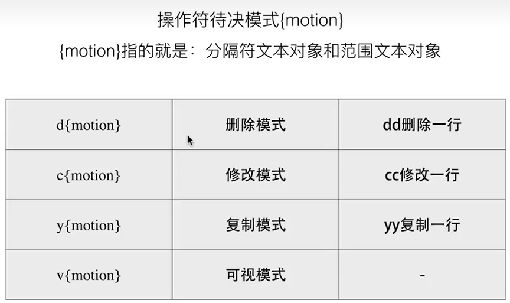
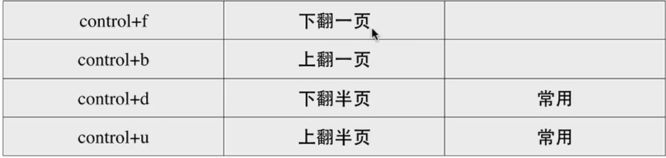
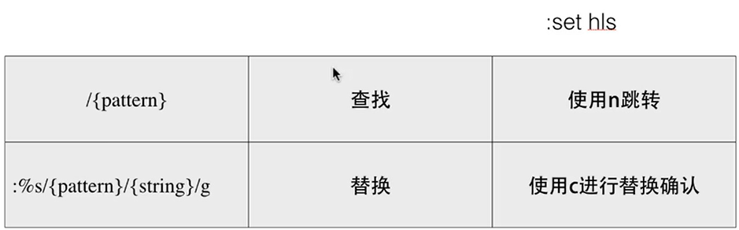

# Vim相关
*vim编辑器之神，emacs神的编辑器*
Vim可以经常用，哪怕是vscode也有vim模式，因为熟练之后对胳膊和颈椎的身体负担很小
推荐把大写锁定与esc的功能进行互换，因为要高频操作esc
**学习宗旨：适合自己的才是最好的。由于vim的命名很多，功能强大，很多命令的效果是相同的，所以不需要全部记住，只记住自己顺手的就行**
## 代替方向键移动
- h 向左移动
- l 向右移动
- k 向上移动
- j 向下移动
## 基于单词的移动

**注意在vim中所有的标点符号都算作一个单词**
重点记住w b e移动就行
## 对字符进行查找

注意事项
- 上述图片中的f和F只对当前行有影响
- {char}只是表示一个单词或者字符，这个花括号不需要输入
- 一般会用t/T 来找标点符号
## 文本对象的选择（重要）
这部分非常重要，可以这么说，把这部分掌握就能飞速编辑


**上图中的命令输入之前先按下小写v进入可视模式，按下大写V是以行为单位进行可视化选中**
*注意事项*
- i 代表in 在里面
- a around代表周围（包括他）
- 小w代表一个单词，大写W代表一个字串
- s代表句子
- p代表段落
- 根据这些理解着记忆，不用死记硬背

## 操作符待决模式(重要)
文本对象的选择和操作符待决模式构成了vim操作的精髓

*注意事项*
- d{motion}删除之后还在普通模式，c{motion}删除之后进入插入模式
- 在普通模式下按u即可撤回操作
- 复制完之后，按下p粘贴


*示例*
删除小括号及小括号里面的内容
```sh
在普通模式下输入
dab
```
**在普通模式下如果想撤回操作，按u就行**
**按下p就能复制吗？**
## 设置标记，快速回跳

*注意事项*
- 设置标记是用在你要离开标记处的时候
- {mark}表示随便什么字符，起到一个标识作用，看个人习惯
- gg跳到文章开头，G跳到文章末尾
- 设置好mark之后，比如设置mark为1那么下次输入`1就能跳转
## 常用的操作
- y 复制
- p 粘贴

输入
```sh
52gg #普通模式下输入直接跳转到第52行
```
*关闭vim界面的所有窗口*
```sh
:qa
```
按下F3打开当前目录下的文件列表
## 常用的插件相关问题
### ctags
*切换打开关闭函数和变量列表的命令*
```sh
:TlistToggle
```
按下*ctrl+ww*在vim中多个串口间进行切换，在ctags的函数列表侧边栏也可以进行查找操作，按下回车跳转到函数定义处。
*查看变量定义*
移动光标到指定变量按下gd
*查找并定位变量出现的位置*
光标选中指定文本，按下F6，
## 查找替换（重要）

*如果你输入想查找的字符之后，发现没有高亮，请输入:set hls来设置一下*
*替换操作的参数含义*
- {pattern} 表示那些字符串被替换
- {string} 表示需要替换成什么
- 替换完直接按enter就行好像不需要按c（按下c好像没啥用啊）
## 批量添加与取消注释
**批量添加注释**
Ctrl + v 进入块选择模式，然后移动光标选中你要注释的行，再按大写的 I 进入行首插入模式输入注释符号如 // 或 #，输入完毕之后，按两下 ESC，Vim 会自动将你选中的所有行首都加上注释，保存退出完成注释。
**批量取消注释**
Ctrl + v 进入块选择模式，选中你要删除的行首的注释符号，注意 // 要选中两个，选好之后按 d 即可删除注释，ESC 保存退出。
## 配色主题相关
原生的vim也自带一些颜色主题，可以在~/.vimrc中进行设置
自带的主题有
- blue
- darkblue
- default
- delek
- desert
- elflord
- evening
- industry
- koehler
- morning
- murphy
- pablo
- peachpuff
- ron
- shine
- slate
- torte
- zellner
也可以去主题分享网站中下载自己喜欢的主题
http://jetbrains-active.com/vim/list.html
## 查看格式转换格式
由于win下的文件换行符与linux下不同，有时需要手动转换一下
*查看文件格式*
在普通模式下输入
```sh
:set ff?
```
查看文件格式
*设置unix或者dos格式*
```sh
:set ff=unix 设置linux下的文件格式
:set ff=dos 设置win下的文件格式
```
## 批量删除^M后缀
如果win下的文档上传到linux，每行的结尾都会出现一个^M，(^M是ctrl+v,ctrl+m，，一般是ctrl+m产生的)
如果是单个文档的话，可以用vi打开，执行 :%s/^M//g　来去掉^M,
但如里批量去除的话就不能用vi了，
方法１:　用dos2unix工具，把win文档转换成linux下文档命令:
```sh
find ./ -type f -print0 | xargs -0 dos2unix
```
如果想把linux下的文档转换成win下的:
```sh
find ./ -type f -print0 | xargs -0 unix2dos
```
方法2: 用sed命令把win文档转换成linux下文档:
```sh
find ./ -type f print0 | xargs -0 sed -i 's/^M$//'
```
把linux下的文档转换成win下的（这条指令貌似不对）
```sh
fild ./ -type f print0 | xargs -0 sed -i 's/$/^M/' 
```
## .vimrc文件
**不要追求在vim中安装各种插件，尽管安装各类插件之后很强大，但是如果是为了插件，那我为啥不用vscode呢？用vim也只是为了能胜任各种环境下的编辑**
这个文件是vim的配置文件，可以设置一些模式和自定义命令啥的
默认是在
```sh
~/.vimrc
```
感兴趣的可以自己百度学习一下这个脚本语言，在此直接用别人配置好的
1.自动插入文件头 ，新建C、C++源文件时自动插入表头：包括文件名、作者、联系方式、建立时间等。（我个人是不太喜欢新建源
文件时自动插入表头文件名，所以将其注释，读者可根据需求自行更改）
2.按“F2”可以直接消除代码中的空行
3.“F3”可列出当前目录文件，打开树状文件目录
4.支持鼠标选择、方向键移动
5.代码高亮，自动缩进，显示行号，显示状态行（我个人不太喜欢显示行号，显示状态行，读者可根据需求自行修改）  
6.按“Ctrl + P”可自动补全
7.[]、{}、()、""、' '等都自动补全
8.其他功能读者可以研究以下文件
```sh
"=========================================================================
"
"" DesCRiption: 适合自己使用的vimrc文件，for Linux/Windows, GUI/Console
"
""=========================================================================
syntax on "自动语法高亮
"winpos 5 5          " 设定窗口位置  
"set lines=40 columns=155    " 设定窗口大小  
"set nu              " 显示行号  
set go=             " 不要图形按钮  
"color asmanian2     " 设置背景主题  
set guifont=Courier_New:h10:cANSI   " 设置字体  
"syntax on           " 语法高亮  
"autocmd InsertLeave * se nocul  " 用浅色高亮当前行  
"autocmd InsertEnter * se cul    " 用浅色高亮当前行  
"set ruler           " 显示标尺  
set showcmd         " 输入的命令显示出来，看的清楚些  
"set cmdheight=1     " 命令行（在状态行下）的高度，设置为1  
"set whichwrap+=<,>,h,l   " 允许backspace和光标键跨越行边界(不建议)  
"set scrolloff=3     " 光标移动到buffer的顶部和底部时保持3行距离  
set novisualbell    " 不要闪烁(不明白)  
"set statusline=%F%m%r%h%w\ [FORMAT=%{&ff}]\ [TYPE=%Y]\ [POS=%l,%v][%p%%]\ %{strftime(\"%d/%m/%y\ -\ %H:%M\")}   "状态行显示的内容  
"set laststatus=1    " 启动显示状态行(1),总是显示状态行(2)  
set foldenable      " 允许折叠  
set foldmethod=manual   " 手动折叠  
"set background=dark "背景使用黑色 
set nocompatible  "去掉讨厌的有关vi一致性模式，避免以前版本的一些bug和局限  
" 显示中文帮助
if version >= 603
    set helplang=cn
    set encoding=utf-8
endif
" 设置配色方案
"colorscheme murphy
"字体 
"if (has("gui_running")) 
"   set guifont=Bitstream\ Vera\ Sans\ Mono\ 10 
"endif 


 
set fencs=utf-8,ucs-bom,shift-jis,gb18030,gbk,gb2312,cp936
set termencoding=utf-8
set encoding=utf-8
set fileencodings=ucs-bom,utf-8,cp936
set fileencoding=utf-8"""""""""""""""""""""""""""""""""""""""""""""""""""""""""""""""""""""""""""""""""""""""""""""""""
"""""新文件标题""""""""""""""""""""""""""""""""""""""""""""""""""""""""""""""""""""""""""""""""""""""""""""""""
"新建.c,.h,.sh,.java文件，自动插入文件头 
autocmd BufNewFile *.cpp,*.[ch],*.sh,*.java exec ":call SetTitle()" 
""定义函数SetTitle，自动插入文件头 
func SetTitle() 
    "如果文件类型为.sh文件 
    if &filetype == 'sh' 
        call setline(1,"\#########################################################################") 
        call append(line("."), "\# File Name: ".expand("%")) 
        call append(line(".")+1, "\# Author: 冷倾殇") 
        call append(line(".")+2, "\# mail: 1500428751@qq.com") 
        call append(line(".")+3, "\# Created Time: ".strftime("%c")) 
        call append(line(".")+4, "\#########################################################################") 
        call append(line(".")+5, "\#!/bin/bash") 
        call append(line(".")+6, "") 
    else 
        call setline(1, "/*************************************************************************") 
        call append(line("."), "    > File Name: ".expand("%")) 
        call append(line(".")+1, "    > Author: 冷倾殇") 
        call append(line(".")+2, "    > Mail: 1500428751@qq.com ") 
        call append(line(".")+3, "    > Created Time: ".strftime("%c")) 
        call append(line(".")+4, " ************************************************************************/") 
        call append(line(".")+5, "")
    endif
 "   if &filetype == 'cpp'
 "       call append(line(".")+6, "#include<iostream>")
 "       call append(line(".")+7, "using namespace std;")
 "       call append(line(".")+8, "")
 "   endif
 "   if &filetype == 'c'
 "       call append(line(".")+6, "#include<stdio.h>")
 "       call append(line(".")+7, "")
 "   endif
    "新建文件后，自动定位到文件末尾
    autocmd BufNewFile * normal G
endfunc 
""""""""""""""""""""""""""""""""""""""""""""""""""""""""""""""""""""""""""""""""""""""""""""""""""""""
"键盘命令
""""""""""""""""""""""""""""""""""""""""""""""""""""""""""""""""""""""""""""""""""""""""""""""""""""""


nmap <leader>w :w!<cr>
nmap <leader>f :find<cr>


" 映射全选+复制 ctrl+a
map <C-A> ggVGY
map! <C-A> <Esc>ggVGY
map <F12> gg=G
" 选中状态下 Ctrl+c 复制
vmap <C-c> "+y
"去空行  
nnoremap <F2> :g/^\s*$/d<CR> 
"比较文件  
nnoremap <C-F2> :vert diffsplit 
"新建标签  
map <M-F2> :tabnew<CR>  
"列出当前目录文件  
map <F3> :tabnew .<CR>  
"打开树状文件目录  
map <C-F3> \be  
"C，C++ 按F5编译运行
map <F5> :call CompileRunGcc()<CR>
func! CompileRunGcc()
    exec "w"
    if &filetype == 'c'
        exec "!g++ % -o %<"
        exec "! ./%<"
    elseif &filetype == 'cpp'
        exec "!g++ % -o %<"
        exec "! ./%<"
    elseif &filetype == 'java' 
        exec "!javac %" 
        exec "!java %<"
    elseif &filetype == 'sh'
        :!./%
    endif
endfunc
"C,C++的调试
map <F8> :call Rungdb()<CR>
func! Rungdb()
    exec "w"
    exec "!g++ % -g -o %<"
    exec "!gdb ./%<"
endfunc
""""""""""""""""""""""""""""""""""""""""""""""""""""""""""""""""""""""""""""""""""""""""""""""""""""""
""实用设置
"""""""""""""""""""""""""""""""""""""""""""""""""""""""""""""""""""""""""""""""""""""""""""""""""""""
" 设置当文件被改动时自动载入
set autoread
" quickfix模式
autocmd FileType c,cpp map <buffer> <leader><space> :w<cr>:make<cr>
"代码补全 
set completeopt=preview,menu 
"允许插件  
filetype plugin on
"共享剪贴板  
set clipboard+=unnamed 
"从不备份  
set nobackup
"make 运行
:set makeprg=g++\ -Wall\ \ %
"自动保存
set autowrite
"set ruler                   " 打开状态栏标尺
set cursorline              " 突出显示当前行
set magic                   " 设置魔术
set guioptions-=T           " 隐藏工具栏
set guioptions-=m           " 隐藏菜单栏
"set statusline=\ %<%F[%1*%M%*%n%R%H]%=\ %y\ %0(%{&fileformat}\ %{&encoding}\ %c:%l/%L%)\
" 设置在状态行显示的信息
set foldcolumn=0
set foldmethod=indent 
set foldlevel=3 
set foldenable              " 开始折叠
" 不要使用vi的键盘模式，而是vim自己的
set nocompatible
" 语法高亮
set syntax=on
" 去掉输入错误的提示声音
set noeb
" 在处理未保存或只读文件的时候，弹出确认
set confirm
" 自动缩进
set autoindent
set cindent
" Tab键的宽度
set tabstop=4
" 统一缩进为4
set softtabstop=4
set shiftwidth=4
" 不要用空格代替制表符
set noexpandtab
" 在行和段开始处使用制表符
set smarttab
" 显示行号
set number
" 历史记录数
set history=1000
"禁止生成临时文件
set nobackup
set noswapfile
"搜索忽略大小写
set ignorecase
"搜索逐字符高亮
set hlsearch
set incsearch
"行内替换
set gdefault
"编码设置
set enc=utf-8
set fencs=utf-8,ucs-bom,shift-jis,gb18030,gbk,gb2312,cp936
"语言设置
set langmenu=zh_CN.UTF-8
set helplang=cn
" 我的状态行显示的内容（包括文件类型和解码）
"set statusline=%F%m%r%h%w\ [FORMAT=%{&ff}]\ [TYPE=%Y]\ [POS=%l,%v][%p%%]\ %{strftime(\"%d/%m/%y\ -\ %H:%M\")}
"set statusline=[%F]%y%r%m%*%=[Line:%l/%L,Column:%c][%p%%]
" 总是显示状态行
"set laststatus=2
" 命令行（在状态行下）的高度，默认为1，这里是2
set cmdheight=2
" 侦测文件类型
filetype on
" 载入文件类型插件
filetype plugin on
" 为特定文件类型载入相关缩进文件
filetype indent on
" 保存全局变量
set viminfo+=!
" 带有如下符号的单词不要被换行分割
set iskeyword+=_,$,@,%,#,-
" 字符间插入的像素行数目
set linespace=0
" 增强模式中的命令行自动完成操作
set wildmenu
" 使回格键（backspace）正常处理indent, eol, start等
set backspace=2
" 允许backspace和光标键跨越行边界
set whichwrap+=<,>,h,l
" 可以在buffer的任何地方使用鼠标（类似office中在工作区双击鼠标定位）
set mouse=a
set selection=exclusive
set selectmode=mouse,key
" 通过使用: commands命令，告诉我们文件的哪一行被改变过
set report=0
" 在被分割的窗口间显示空白，便于阅读
set fillchars=vert:\ ,stl:\ ,stlnc:\
" 高亮显示匹配的括号
set showmatch
" 匹配括号高亮的时间（单位是十分之一秒）
set matchtime=1
" 光标移动到buffer的顶部和底部时保持3行距离
set scrolloff=3
" 为C程序提供自动缩进
set smartindent
" 高亮显示普通txt文件（需要txt.vim脚本）
au BufRead,BufNewFile *  setfiletype txt
"自动补全
:inoremap ( ()<ESC>i
:inoremap ) <c-r>=ClosePair(')')<CR>
:inoremap { {<CR>}<ESC>O
:inoremap } <c-r>=ClosePair('}')<CR>
:inoremap [ []<ESC>i
:inoremap ] <c-r>=ClosePair(']')<CR>
:inoremap " ""<ESC>i
:inoremap ' ''<ESC>i
function! ClosePair(char)
    if getline('.')[col('.') - 1] == a:char
        return "\<Right>"
    else
        return a:char
    endif
endfunction
filetype plugin indent on 
"打开文件类型检测, 加了这句才可以用智能补全
set completeopt=longest,menu
"""""""""""""""""""""""""""""""""""""""""""""""""""""""""""""""""""""""""""""""""""""""""""""""""
" CTags的设定  
"""""""""""""""""""""""""""""""""""""""""""""""""""""""""""""""""""""""""""""""""""""""""""""""""
let Tlist_Sort_Type = "name"    " 按照名称排序  
let Tlist_Use_Right_Window = 1  " 在右侧显示窗口  
let Tlist_Compart_Format = 1    " 压缩方式  
let Tlist_Exist_OnlyWindow = 1  " 如果只有一个buffer，kill窗口也kill掉buffer  
let Tlist_File_Fold_Auto_Close = 0  " 不要关闭其他文件的tags  
let Tlist_Enable_Fold_Column = 0    " 不要显示折叠树  
autocmd FileType java set tags+=D:\tools\java\tags  
"autocmd FileType h,cpp,cc,c set tags+=D:\tools\cpp\tags  
"let Tlist_Show_One_File=1            "不同时显示多个文件的tag，只显示当前文件的
"设置tags  
set tags=tags  
"set autochdir 


""""""""""""""""""""""""""""""""""""""""""""""""""""""""""""""""""""""""""""""""""""""""""""""""""""""""""""""""""
"其他东东
"""""""""""""""""""""""""""""""""""""""""""""""""""""""""""""""""""""""""""""""""""""""""""""""""""""""""""""""""
"默认打开Taglist 
let Tlist_Auto_Open=1 
"""""""""""""""""""""""""""""" 
" Tag list (ctags) 
"""""""""""""""""""""""""""""""" 
let Tlist_Ctags_Cmd = '/usr/bin/ctags' 
let Tlist_Show_One_File = 1 "不同时显示多个文件的tag，只显示当前文件的 
let Tlist_Exit_OnlyWindow = 1 "如果taglist窗口是最后一个窗口，则退出vim 
let Tlist_Use_Right_Window = 1 "在右侧窗口中显示taglist窗口
" minibufexpl插件的一般设置
let g:miniBufExplMapWindowNavVim = 1
let g:miniBufExplMapWindowNavArrows = 1
let g:miniBufExplMapCTabSwitchBufs = 1 
let g:miniBufExplModSelTarget = 1
```
## vim遇到的问题记录
### 打开文件显示filetype unknown
报错信息
```sh
filetype unknown
Press ENTER or type command to continue
```
*解决方法*
在.vimrc中将下面这条指令
```vim
set syntax=on
```
改成
```vim
syntax on
```

