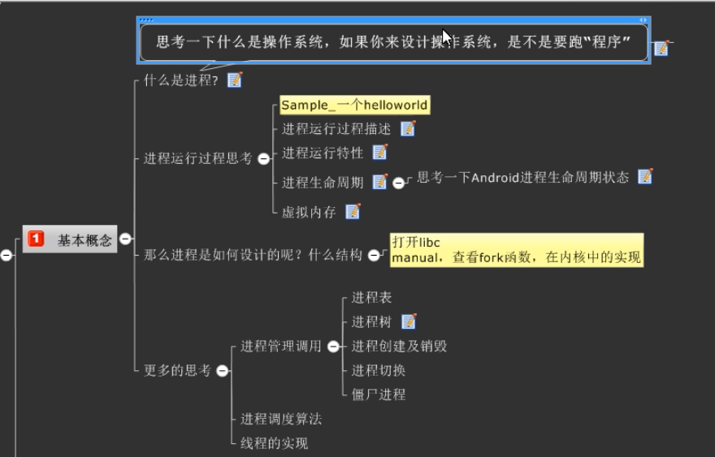
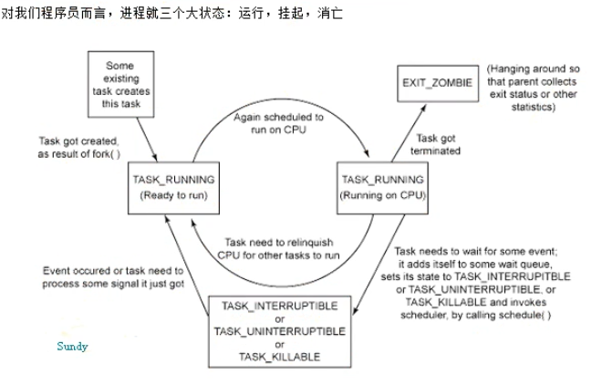
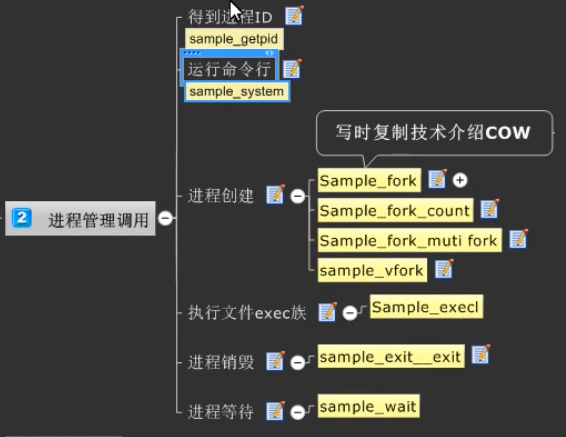

# 应用开发之进程管理
**课程目标**
- 知道进程的概念
- 了解Linux进程的创建，切换和调度机制
- 进程优先级，进程生命周期的掌握
- 了解内核进程数据结构（难点）
- 虚拟内存与进程的关系（难点）
- 进程的独占性（难点）

## 进程相关的概念
*进程通常被定义为一个正在运行的程序的实例* 由两部分组成
- 1 是系统中用来管理进程的内核对象。内核对象也是系统用来存放关于进程统计信息的地方
- 2 是地址空间，它包含所有可执行模块或DLL模块的代码和数据。也包含动态内存分配的空间。如 线程堆栈和堆栈分配空间。

进程运行的过程其实就是把磁盘的二进制文件加载（映射）到内存空间中，并指引CPU去内存中寻址，然后运算并且返回（I/O）的过程。

**题外话** 实现进程管理有2种思路。
- 1 在操作系统内核中实现(Linux和Windows的做法)
- 2 在系统类库层中实现（也被称为虚拟机，安卓和JAVA的做法）

*在windos系统中用拓展名来判断是否是一个可执行文件，而Linux是根据文件权限判断*（了解性）
**小知识点**
- 2的10次方代表1K
- 2的20次方代表1M
- 2的30次方代表1G
### 进程的运行特性
**多任务，多进程“并发”，linux系统是多任务分时的**
一个独立的逻辑控制流，好像我们的程序在独占使用CPU
*实现方法：* 进程调度
**进程间彼此独立，所处内存互相隔离**
每个进程有一个私有的地址空间，好像我们程序独占使用内存
*实现方法：* 虚拟内存（毕竟32位操作系统实际能寻址的最大物理内存是2的32次方，4G。不通过虚拟内存的思想实现真是遭不住啊）
### 进程生命周期

此处后面补充详细内容
### 虚拟内存
后面细说
### 进程如何设计？什么结构
打开libc的手册，Glibc中有关于进程的函数（Process章节）
查看fork函数在内核中的实现
*示例*
```c
#include <stdio.h>
int main()
{//这种例子还有很多，只是简单做个示例
    system("ls -a");//运行命令行
    return 0;
}//执行后的现象与执行ls -a的现象一致
```
**冷知识**
由于大部分linux系统是分时机制的多任务系统，所以实时性差，若要提高实时性有两种渠道
- 修改内核
- 在系统层实现属于自己的进程调度，不按照内核的调度来。如RTLinux
## 进程管理调用

### 得到进程ID
```c
//可以man一下看看这两个函数的介绍
pid_t getpid(void);//得到当前进程ID
pid_t getppid(void);//得到父进程ID
```
*依赖头文件*
```c
#include <sys/types.h>
#include <unistd.h>
```
*示例*
```c
#include <stdio.h>
#include <sys/types.h>
#include <unistd.h>
int main()
{
    pid_t pid=getpid();
    printf("pid= %d\n",pid);
    pid_t ppid=getppid();
    printf("ppid= %d\n",ppid);
    return 0;
}//上述代码会打印出当前进程的pid与父进程的pid
```
### 运行命令行
*函数原型*
```c
int system(const char *command);
```


